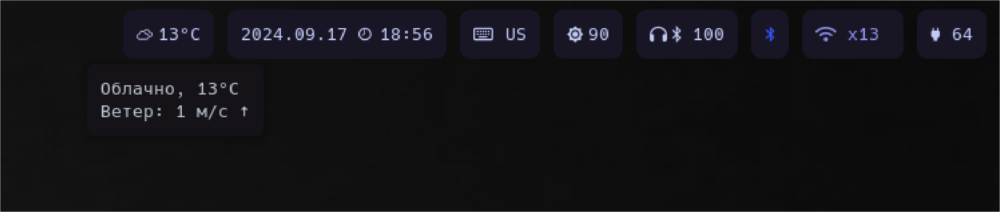

# waybar-yandexweather
Waybar yandex weather module



```json
"modules-right": [
  "custom/wya"
],
```

```json
"custom/wya": {
	"format": "{}",
	"interval": 600,
	"exec": "~/.config/waybar/custom/wya.py",
	"tooltip": true,
	"return-type": "json",
	}	

```
